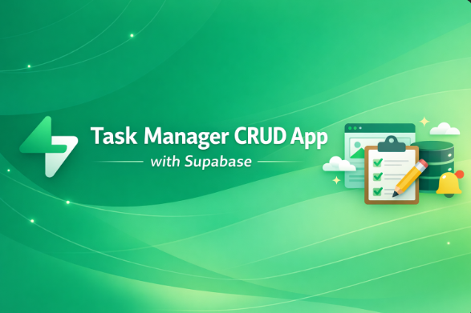

# 🚀 Task Manager CRUD App (React + Supabase)

<p align="center">
  
</p>


A full-stack Task Manager application built using React and Supabase.

This project demonstrates Authentication, Database CRUD operations, Realtime updates, and File Storage using Supabase.

[Live Demo](https://supabase-task-manager-ecru.vercel.app/)

---

## 📌 Features

- ✅ User Sign Up & Sign In (Email + Password)
- ✅ Session Management
- ✅ Protected Routes
- ✅ Create Task
- ✅ Read Tasks (Filtered per user)
- ✅ Update Task
- ✅ Delete Task
- ✅ Upload Image to Supabase Storage
- ✅ Display Uploaded Images
- ✅ Supabase Realtime Updates
- ✅ Row Level Security (RLS)
- ✅ Multi-user data isolation

---

## 🛠️ Tech Stack

- React (TypeScript)
- Supabase
- Supabase Auth
- PostgreSQL Database
- Supabase Storage
- Supabase Realtime

---

# 🧠 Supabase Concepts Covered

---

## 1️⃣ Authentication

Used methods:

- `signUp()`
- `signInWithPassword()`
- `signOut()`
- `getSession()`
- `onAuthStateChange()`

Concepts learned:

- JWT-based authentication
- Session handling
- Access & refresh tokens
- Auth state listeners
- Persistent login

---

## 2️⃣ Database CRUD Operations

Used:

- `insert()`
- `select()`
- `update()`
- `delete()`
- `.eq()` filtering
- `.order()` sorting
- `.single()` row return

Concepts:

- Async database queries
- Filtering by logged-in user
- Returning inserted data
- Handling errors properly

---

## 3️⃣ Row Level Security (RLS)

Enabled RLS on table.

Policies created for:

- SELECT
- INSERT
- UPDATE
- DELETE

Purpose:

- Ensure users only access their own tasks
- Secure multi-user system

---

## 4️⃣ Realtime Subscriptions

Used:

- `supabase.channel()`
- `postgres_changes`
- `.subscribe()`
- `removeChannel()`

Concepts:

- WebSocket connection
- Live UI updates
- Auto-sync between browser tabs
- Channel cleanup on unmount

---

## 5️⃣ Supabase Storage

Used:

- `storage.from().upload()`
- `getPublicUrl()`

Concepts:

- File upload
- Unique file naming
- Public image URL generation
- Image rendering
- Public bucket configuration

---

## 6️⃣ Session-Based Data Filtering

Tasks filtered using:

```ts
.eq("email", session.user.email)
```

<p> Ensures:</p>

- User sees only their own data

- Secure per-user access

## 📂 Project Structure

```bash
src/
 ├── components/
 │    ├── Auth.tsx
 │    └── Crud.tsx
 ├── utils/
 │    └── supabase.ts
 ├── App.tsx
```

## ⚙️ How To Run This Project

```bash
 1️⃣ Clone the Repository

git clone https://github.com/KarthickRamAlagar/supabase-task-manager

cd project-folder

2️⃣ Install Dependencies

npm install

3️⃣ Create Environment File

Create .env file:
VITE_SUPABASE_URL=your_project_url
VITE_SUPABASE_ANON_KEY=your_anon_key

4️⃣ Start Development Server
npm run dev
```

## 🗄️ Database Schema
```bash
Table: CRUD

Columns:

id (int, primary key)

title (text)

description (text)

created_at (timestamp)

img_url (text)

email (text)
```

## 🔄 Realtime Setup Checklist
- Enable Realtime on table

- Enable replication

- Enable RLS

- Create SELECT policy for authenticated users

## 🖼️ Storage Setup
- Bucket Name: CRUD_imgs

- Settings:

   - Public bucket

- Allow authenticated uploads

## 🎓 Learning Outcomes
- After completing this project, you now understand:

- Full-stack development using Supabase

- Secure authentication system

- JWT session handling

- CRUD operations with PostgreSQL

- Real-time data synchronization

- File upload & storage management

- Row Level Security implementation

- Multi-user architecture

## 🚀 Future Improvements
- Pagination

- Optimistic UI updates

- Loading indicators

- Drag & Drop image upload

- Image preview before upload

- Role-based access control

- Deployment to Vercel or Netlify

## 👨‍💻 Author
Built with KRA - Karthick Ram Alagar using React + Supabase.
<p align="center">
  
</p>

---
